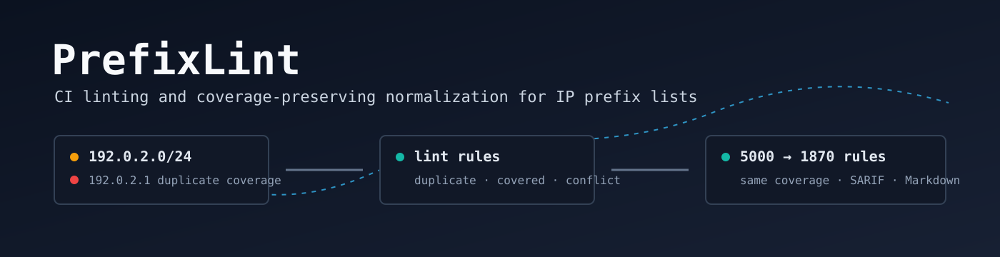
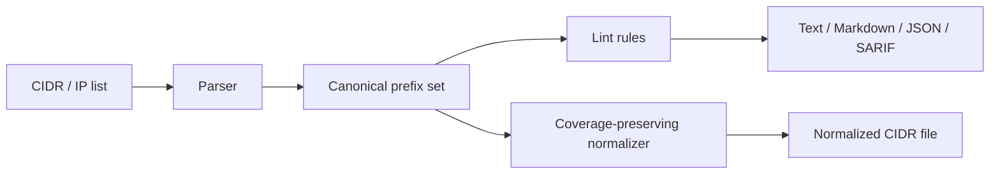

# PrefixLint

PrefixLint is a CI-oriented linter and normalizer for IP prefix lists. It validates deny-lists, allow-lists, ipset inputs, nftables feeds, and CIDR datasets for duplicate rules, redundant coverage, malformed entries, allow/deny conflicts, and normalization impact.

<p align="center">
  
</p>

<p align="center">
  
  
  
  
  
</p>

---

## Overview

IP lists tend to accumulate operational debt: copied prefixes, overlapping ranges, stale exceptions, private space in public blocklists, and conflicting allow/deny rules. PrefixLint gives those lists the same review surface that source code already has: deterministic checks, file and line references, severity controls, normalized output, and pull request feedback.

The default workflow is intentionally small:

```text
prefixlint check --allow allow.txt blocklist.txt

412 duplicate prefixes
37 prefixes fully covered by broader rules
18 allow/deny conflicts
5000 rules -> 1870 rules, same coverage
```

PrefixLint does not need threat-intelligence feeds or external enrichment to be useful. It operates on repository-owned files and produces artifacts that fit normal infrastructure review: terminal output, Markdown summaries, JSON, SARIF, and normalized CIDR output.

---

## System Behavior

PrefixLint parses list files into canonical `netip.Prefix` values, preserves source locations for reporting, and evaluates each rule against the parsed prefix set. Normalization is performed as a coverage-preserving operation:

1. Parse IP addresses and CIDR prefixes.
2. Canonicalize host addresses into `/32` or `/128` prefixes.
3. Remove duplicate prefixes.
4. Remove prefixes fully covered by broader entries.
5. Collapse adjacent prefixes when the resulting broader prefix has identical coverage.
6. Emit sorted canonical CIDR output.

The linter and normalizer share the same prefix model. A `check` report explains why a list is inefficient or unsafe to merge; `fix` emits the compact representation.



---

## Features

| Area | Capability |
| --- | --- |
| Prefix hygiene | Detect duplicate prefixes and entries covered by broader rules. |
| Conflict analysis | Compare deny-list and allow-list coverage. |
| Syntax validation | Report malformed IP addresses and CIDR prefixes with line numbers. |
| Normalization | Deduplicate, sort, remove covered rules, and collapse adjacent prefixes. |
| CI output | Text, Markdown, JSON, and SARIF report formats. |
| Rule control | Configure rule severity or disable rules with `.prefixlintrc.json`. |
| GitHub-native workflow | Composite Action for pull request checks and job summaries. |
| IPv4 / IPv6 | Uses Go `net/netip` for native IPv4 and IPv6 prefix handling. |

---

## Quick Start

Run a local check:

```sh
go run ./cmd/prefixlint check examples/deny.txt
```

Check deny-list coverage against an allow-list:

```sh
go run ./cmd/prefixlint check \
  --allow examples/allow.txt \
  --config .prefixlintrc.json \
  examples/deny.txt
```

Normalize a list without modifying the input:

```sh
go run ./cmd/prefixlint fix examples/deny.txt
```

Rewrite the input file in place:

```sh
go run ./cmd/prefixlint fix -w lists/deny.txt
```

---

## Installation

### From Go

```sh
go install github.com/ipanalytics/PrefixLint/cmd/prefixlint@latest
```

### From Source

```sh
git clone https://github.com/ipanalytics/PrefixLint.git
cd prefixlint
go test ./...
go build -o prefixlint ./cmd/prefixlint
```

### GitHub Action

```yaml
name: PrefixLint

on:
  pull_request:
    paths:
      - "lists/**"
      - "**/*.cidr"
      - "**/*.netset"

jobs:
  prefixlint:
    runs-on: ubuntu-latest
    permissions:
      contents: read
    steps:
      - uses: actions/checkout@v4
      - uses: ipanalytics/PrefixLint@v1
        with:
          list: lists/deny.txt
          allow: lists/allow.txt
          fail-on: warning
```

The Action writes a Markdown report into the GitHub Actions job summary. SARIF output can be generated by the CLI for code scanning pipelines that upload SARIF separately.

---

## Usage

### Check a List

```sh
prefixlint check blocklist.txt
```

Example output:

```text
prefixlint: 6 rules -> 3 rules, same coverage
duplicates: 1, covered: 1, conflicts: 1, malformed: 0
examples/deny.txt:3: warning duplicate: 192.0.2.0/24 duplicates line 1
examples/deny.txt:2: warning covered: 192.0.2.1/32 is fully covered by broader prefix 192.0.2.0/24 on line 1
examples/deny.txt:1: error allow-deny-conflict: deny 192.0.2.0/24 conflicts with allow 192.0.2.128/25 on line 1
```

### Compare Deny and Allow Lists

```sh
prefixlint check --allow allow.txt deny.txt
```

Conflict detection is coverage-based. A deny `/24` conflicts with an allow `/25` inside that range, and an allow `/24` conflicts with a narrower deny prefix inside it.

### Generate Markdown

```sh
prefixlint check \
  --format markdown \
  --markdown-out prefixlint.md \
  lists/deny.txt
```

### Generate SARIF

```sh
prefixlint check --format sarif lists/deny.txt > prefixlint.sarif
```

### Normalize Coverage

```sh
prefixlint fix lists/deny.txt > lists/deny.normalized.txt
```

Normalization emits canonical CIDR prefixes sorted by address family and address order.

---

## Outputs and Artifacts

| Format | Use |
| --- | --- |
| `text` | Local terminal use and CI logs. |
| `markdown` | GitHub job summaries and pull request comments. |
| `json` | Automation, dashboards, and downstream analysis. |
| `sarif` | Code scanning and security review systems. |
| normalized CIDR | Compact list output from `prefixlint fix`. |

JSON reports contain a summary and a finding list:

```json
{
  "summary": {
    "input_rules": 5000,
    "normalized_rules": 1870,
    "duplicate_prefixes": 412,
    "covered_prefixes": 37,
    "allow_deny_conflicts": 18,
    "coverage_unchanged": true
  },
  "findings": []
}
```

---

## Data Format

PrefixLint accepts plain text files containing one IP address or CIDR prefix per line:

```text
192.0.2.0/24
192.0.2.1
2001:db8::/32
203.0.113.0/25 # ticket SEC-1248
```

Parsing rules:

| Input | Behavior |
| --- | --- |
| `192.0.2.1` | Treated as `192.0.2.1/32`. |
| `2001:db8::1` | Treated as `2001:db8::1/128`. |
| `192.0.2.0/24` | Parsed as an IPv4 prefix. |
| `2001:db8::/32` | Parsed as an IPv6 prefix. |
| `# comment` | Ignored. |
| Inline `# comment` | Ignored for parsing; source line remains available for reporting. |

Current `fix` output is canonical CIDR-only output. Comment-preserving rewrites are part of the project roadmap because they require stable attachment semantics when multiple prefixes collapse into one broader rule.

---

## Rule Configuration

Rules can be disabled or assigned a severity in `.prefixlintrc.json`:

```json
{
  "rules": {
    "malformed": "error",
    "duplicate": "warning",
    "covered": "warning",
    "allow-deny-conflict": "error",
    "private-in-public-blocklist": "info"
  }
}
```

Run with:

```sh
prefixlint check --config .prefixlintrc.json lists/deny.txt
```

Supported severity values:

| Value | Meaning |
| --- | --- |
| `error` | Fails by default and should block merge in strict CI. |
| `warning` | Fails when `--fail-on warning` is used. |
| `info` | Reported for visibility. |
| `off` | Rule is disabled. |

The workflow failure threshold is controlled separately:

```sh
prefixlint check --fail-on error lists/deny.txt
prefixlint check --fail-on none lists/deny.txt
```

---

## Rules

| Rule | Default | Description |
| --- | --- | --- |
| `malformed` | `error` | Invalid IP address or CIDR prefix. |
| `duplicate` | `warning` | Prefix appears more than once. |
| `covered` | `warning` | Prefix is fully covered by a broader rule. |
| `allow-deny-conflict` | `error` | Allow-list and deny-list coverage overlap. |
| `private-in-public-blocklist` | `info` | Private, loopback, or link-local space appears in a public blocklist. |

---

## Operational Notes

PrefixLint is designed for repositories where list changes are reviewed like code changes. The high-value CI pattern is to run `check` on pull requests and reserve `fix` for maintainers or automated cleanup branches.

For large lists, rule output should be treated as review metadata rather than an opaque pass/fail result. Duplicate and coverage findings are usually cleanup tasks. Allow/deny conflicts are operationally significant because they indicate ambiguity between enforcement policy and exception policy.

Recommended CI behavior:

| Repository Type | Suggested Threshold |
| --- | --- |
| Public community blocklist | `--fail-on warning` |
| Internal production allow/deny policy | `--fail-on error` |
| Migration or audit branch | `--fail-on none` with report artifact |

---

## Use Cases

- Pull request review for public blocklist repositories.
- CI checks for nftables, ipset, firewall, and routing policy inputs.
- Cleanup of threat-intelligence feed exports before loading into constrained systems.
- Validation of corporate allow/deny exception files.
- Drift detection for manually maintained CIDR datasets.
- SARIF-backed review of infrastructure policy repositories.

---

## Project Scope

PrefixLint focuses on list correctness, reviewability, and coverage-preserving normalization.

In scope:

- CIDR and host IP parsing.
- IPv4 and IPv6 prefix analysis.
- Duplicate, overlap, conflict, and malformed-entry detection.
- Deterministic normalization.
- CI-friendly reporting.
- Rule severity configuration.

Planned extensions:

- Comment-preserving fixes.
- Sticky pull request comments.
- Native SARIF upload workflow examples.
- Optional semantic checks against bogon ranges, cloud provider ranges, and RIR delegated statistics.
- Multi-file project configuration.

---

## Limitations

PrefixLint does not decide whether a prefix should be blocked. It evaluates the structure and consistency of the lists supplied to it.

`fix` currently emits canonical CIDR output and does not preserve comments. When adjacent prefixes collapse into a broader prefix, comment ownership can become ambiguous; preserving useful annotations requires explicit policy.

The current implementation is optimized for clear CI behavior and deterministic output. Very large datasets should be tested with representative repository workloads before enforcing strict merge gates.

---

## Directory Structure

```text
.
├── action.yml                     # GitHub composite Action
├── cmd/prefixlint/                # CLI entrypoint
├── examples/                      # Example deny/allow lists
├── internal/prefixlint/           # Parser, rules, normalizer, reports
├── .github/workflows/             # Example CI workflow
├── .prefixlintrc.json             # Example rule configuration
├── go.mod
└── README.md
```

---

## Deployment

PrefixLint can run as a developer tool, a CI step, or a scheduled repository audit.

### Pull Request Gate

```yaml
- uses: ipanalytics/PrefixLint@v1
  with:
    list: lists/deny.txt
    allow: lists/allow.txt
    fail-on: warning
```

### Scheduled Audit

```yaml
on:
  schedule:
    - cron: "15 3 * * *"
```

Use scheduled audits when lists are generated by external jobs and pull request checks do not cover every update path.

### Artifact Collection

```sh
prefixlint check --format json lists/deny.txt > prefixlint.json
prefixlint check --format sarif lists/deny.txt > prefixlint.sarif
prefixlint fix lists/deny.txt > deny.normalized.txt
```

Store JSON and SARIF with CI artifacts when list quality trends matter over time.

---

## Development

```sh
go test ./...
go run ./cmd/prefixlint check --allow examples/allow.txt examples/deny.txt
go run ./cmd/prefixlint fix examples/deny.txt
```

The codebase intentionally keeps the core prefix logic small and inspectable. Rules should produce actionable findings with stable file and line references.

<details>
<summary>Maintainer checklist for new rules</summary>

- The rule has a stable ID.
- The default severity matches operational impact.
- Findings include source file and line number when possible.
- The rule can be disabled through `.prefixlintrc.json`.
- Tests cover IPv4 and IPv6 behavior where applicable.
- Report output remains deterministic.

</details>

---

## License

PrefixLint is licensed under the Apache License, Version 2.0. See [LICENSE](./LICENSE).

---

## Disclaimer

PrefixLint is an infrastructure quality tool. Operators remain responsible for validating the policy impact of any blocklist or allow-list before deploying it to production enforcement systems.
